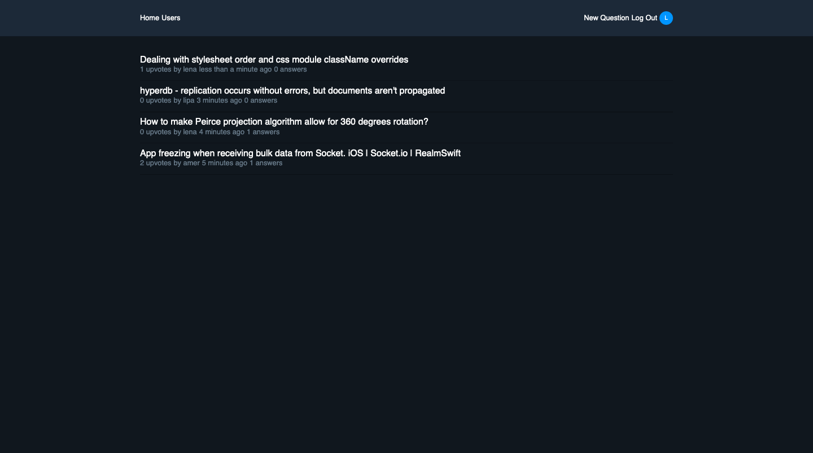

# QA-client

[](https://github.com/styled-components/styled-components)
[](https://github.com/prettier/prettier)
[](https://github.com/malcodeman/qa-client/blob/master/LICENSE)

Unlimited private questions and answers in a searchable archive, inspired by [stackoverflow teams](https://stackoverflow.com/teams).



## Usage

.env.development.local file should look like this:

```
REACT_APP_API_URL = "http://localhost:9001/api"
```

To start the app run:

```
yarn install
yarn start
```

Api is located [here](https://github.com/malcodeman/qa-server).

## License

[MIT](./LICENSE)
